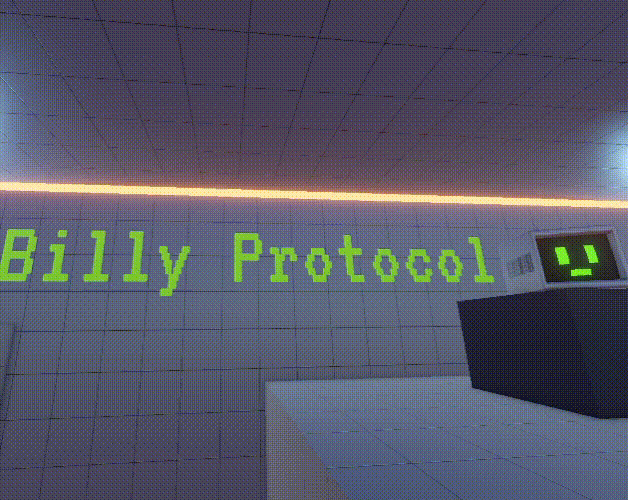

# Billy Protocol: Mini Puzzle Platoformer

## About the Game
**Billy Protocol** is a solo-made game developed during the GMTK Game Jam 2025 in just 4 days.  
In the game, you play as Billy who has the ability to create digital ghosts to traverse levels, loop through checkpoints, solve puzzles, activate switches, and help Billy escape the system.  
Play the game on itch.io: [Billy Protocol](https://ayanchavand.itch.io/billy-protocol)
This repository contains **all the C# scripts** used to implement gameplay mechanics, UI, and systems in the game.  

> Note: This repo only includes scripts for portfolio purposes. Art, audio, and builds are not included.

---

## Features Implemented in Scripts
- Player movement and ghost mechanics  
- Level interaction: checkpoints, switches, jump pads  
- UI management and stats tracking  
- Procedural animations (face expressions, blinking)  
- Ambience and audio management  
- Game statistics manager and singleton patterns  

All scripts are commented and include `
` tags where appropriate, showcasing clean architecture and Unity best practices.

---

## Built With
- **Unity 6**  
- **C#** (all gameplay systems, managers, and utilities)  
- **Custom Scripts & ScriptableObjects** for modular and reusable game logic  

## How to Use This Repo
This repository is intended as a **portfolio of Unity scripts**. To use:  

1. Clone the repo.  
2. Open a Unity project and copy the scripts into your `Assets/Scripts` folder.  
3. All scripts are organized and ready to integrate into a Unity project.  

> Note: This repo does **not include art, materials, prefabs, or audio**, so some scripts may reference assets not included here.
